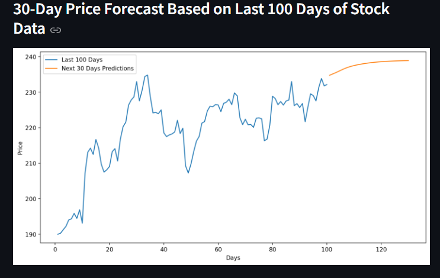
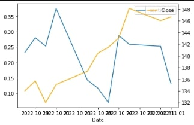

# Stock_Price_Forecasting_with_LSTM
Check out the live demo: [Stock Price Forecasting with LSTM](https://stock-price-forecasting-with-lstm.streamlit.app/)
## Project Overview

This project leverages an LSTM model to forecast stock prices using historical data. The application retrieves live stock data from Yahoo Finance and predicts future prices based on past performance. It features various visualizations to aid in analyzing the stock's historical trends and predicted future movements.

## Key Features

- **Live Data Retrieval**: The application fetches live stock price data using the Yahoo Finance API(i have set default to tata steel).
- **Current Price Display**: Shows the latest closing price of the selected stock.
- **Future Price Predictions**: Predicts the stock price for the next 10 days using historical data.

## Visualizations

The application generates several key visualizations:

1. **Closing Price vs Time Chart**:
   - Displays the historical closing prices of the selected stock.
     
     <!-- Update the image path accordingly -->

2. **Closing Price with 100-Day Moving Average (MA)**:
   - Visualizes the stock's closing price alongside its 100-day moving average, helping to identify trends.
     
     <!-- Update the image path accordingly -->

3. **Closing Price with 100-Day and 200-Day Moving Averages (MA)**:
   - Compares the closing price with both the 100-day and 200-day moving averages.
     
     <!-- Update the image path accordingly -->

4. **Predicted vs Original Prices using LSTM**:
   - Shows a comparison between the original and predicted stock prices to evaluate model performance.
     
   

    note-the x-axis represents days of stock price data used in testing, where each point corresponds to a day in the historical price dataset.  <!-- Update the image path accordingly -->

5. **Next 10 Days Price Prediction**:
   - Displays the predicted stock prices for the next 10 business days based on the last 100 days of data.
     
     <!-- Update the image path accordingly -->

6.Sentiment vs closing price for Tatasteel

